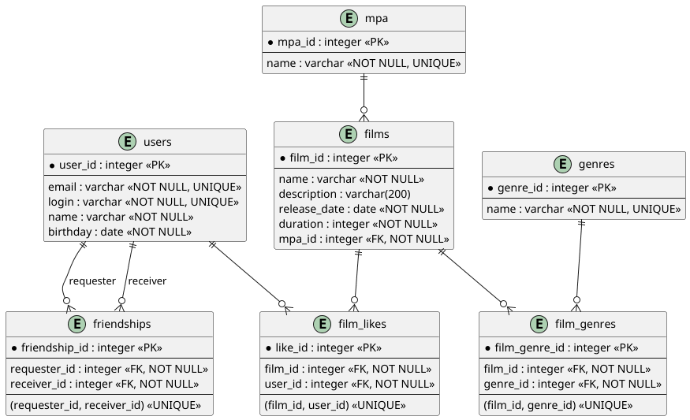

## Схема базы данных

Для хранения данных приложения спроектирована реляционная база данных, отражающая существующую бизнес-логику
`Filmorate`.



### Основные сущности

* `users` — пользователи приложения.
* `films` — фильмы.
* `mpa` — справочник возрастных рейтингов MPA.
* `genres` — справочник жанров.
* `film_genres` — связь фильмов и жанров (многие ко многим).
* `film_likes` — лайки пользователей фильмам.
* `friendships` — односторонние отношения дружбы между пользователями.

### Особенности модели

Все таблицы имеют собственные первичные ключи.

Связи «многие ко многим» реализованы через отдельные таблицы:

* фильм ↔ жанр — `film_genres`;
* пользователь ↔ фильм — `film_likes`.

Дружба в `Filmorate` является односторонней. Таблица `friendships` хранит:

* пользователя, добавившего другого пользователя в друзья (`requester_id`);
* пользователя, добавленного в друзья (`receiver_id`).

Наличие записи в таблице `friendships` означает, что пользователь `requester_id` добавил пользователя `receiver_id` в
свой список друзей. Отдельного подтверждения дружбы не требуется.

Для предотвращения дублирования связей используются уникальные ограничения на пары внешних ключей.

## Примеры основных запросов

### Получить всех пользователей

```sql
SELECT *
FROM users;
```

### Получить все фильмы

```sql
SELECT *
FROM films;
```

### Получить фильм вместе с рейтингом MPA

```sql
SELECT f.film_id,
       f.name,
       f.description,
       f.release_date,
       f.duration,
       m.name AS mpa_rating
FROM films AS f
JOIN mpa AS m ON f.mpa_id = m.mpa_id;
```

### Получить жанры фильма

```sql
SELECT g.name
FROM genres AS g
JOIN film_genres AS fg ON g.genre_id = fg.genre_id
WHERE fg.film_id = :filmId;
```

### Получить популярные фильмы

```sql
SELECT f.film_id,
       f.name,
       COUNT(fl.like_id) AS likes_count
FROM films AS f
LEFT JOIN film_likes AS fl ON f.film_id = fl.film_id
GROUP BY f.film_id,
         f.name
ORDER BY likes_count DESC
LIMIT :count;
```

### Получить друзей пользователя

```sql
SELECT u.*
FROM users AS u
JOIN friendships AS f
    ON u.user_id = f.receiver_id
WHERE f.requester_id = :userId
ORDER BY u.user_id;
```

### Получить общих друзей двух пользователей

```sql
SELECT u.*
FROM users AS u
JOIN friendships AS f1
    ON u.user_id = f1.receiver_id
JOIN friendships AS f2
    ON u.user_id = f2.receiver_id
WHERE f1.requester_id = :userId
  AND f2.requester_id = :otherId
ORDER BY u.user_id;
```
